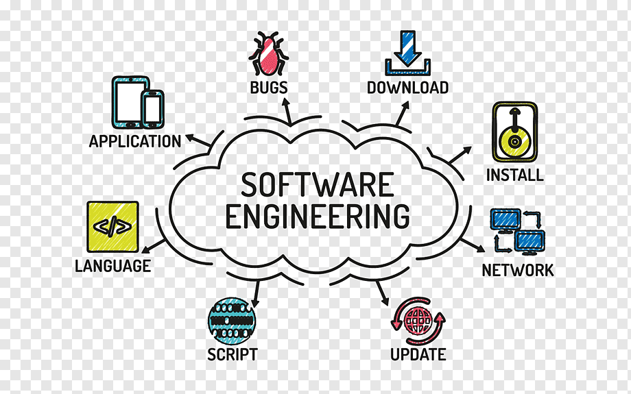

<h1 align="center">Hi 👋, I'm Rakshith K R</h1>
<h3 align="center">A passionate full stack developer from India</h3>

- 🌱 I’m currently learning **react js,redux js, **

- 💬 Ask me about **python, Java,mysql**

- 📫 How to reach me **krrakshith12@gmail.com**

<h3 align="left">Connect with me:</h3>

<h3 align="left">Languages and Tools:</h3>

   <a href="[https://flask.palletsprojects.com/](https://in.images.search.yahoo.com/images/view;_ylt=AwrKC_0W4BhnNLwhHoS9HAx.;_ylu=c2VjA3NyBHNsawNpbWcEb2lkA2NiODk2NGQ2NDZkZGIxZTBmYzkzYzBlN2E3NTFhYmZjBGdwb3MDMgRpdANiaW5n?back=https%3A%2F%2Fin.images.search.yahoo.com%2Fsearch%2Fimages%3Fp%3Djava%2Blogo%26type%3DE210IN826G0%26fr%3Dmcafee%26fr2%3Dpiv-web%26tab%3Dorganic%26ri%3D2&w=1024&h=1024&imgurl=brandlogos.net%2Fwp-content%2Fuploads%2F2021%2F11%2Fjava-logo.png&rurl=https%3A%2F%2Fbrandlogos.net%2Fjava-programming-language-logo-icon-vector-94384.html&size=20KB&p=java+logo&oid=cb8964d646ddb1e0fc93c0e7a751abfc&fr2=piv-web&fr=mcafee&tt=Java+logo+mark+in+vector+%28.EPS+%2B+.SVG+%2B+.PDF%29+for+free+-+Brandlogos.net&b=0&ni=21&no=2&ts=&tab=organic&sigr=3dn1Lyt81HLp&sigb=vz_tTZ6B.5_R&sigi=PyTImnJZ2SYl&sigt=jdG.ivpop41.&.crumb=Mp1jtWAapQ.&fr=mcafee&fr2=piv-web&type=E210IN826G0)" target="_blank" rel="noreferrer">  </a>      

&nbsp;

