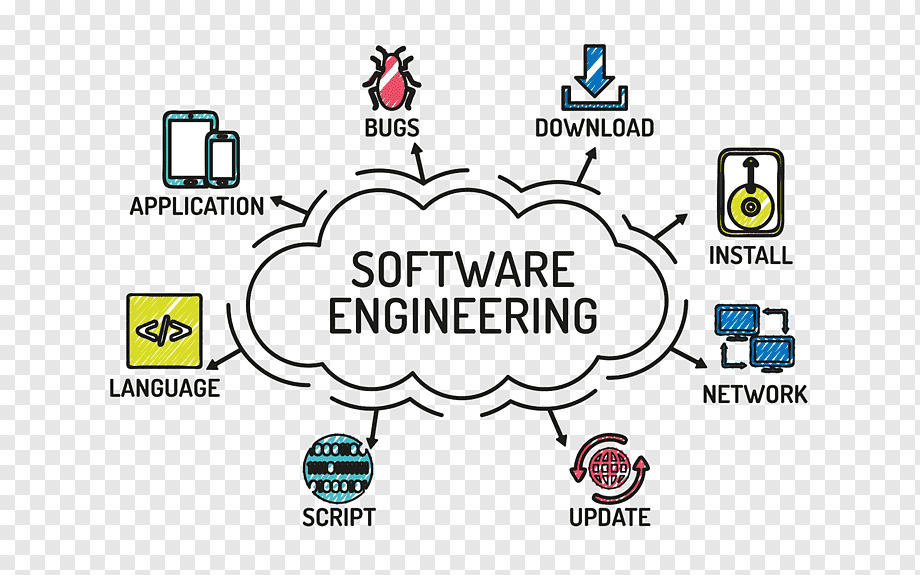

<h1 align="center">Hi 👋, I'm Rakshith K R</h1>
<h3 align="center">Full‑Stack & AI Engineer • Building Intelligent SaaS, Analytics & AI‑Powered Products in 2026</h3>

  
  

## 🚀 About Me & 2026 Focus

- 🔭 Currently building **AI‑powered analytics platforms and enterprise SaaS products**
- 🌱 Deepening my skills in:
  - **System Design & Distributed Systems**
  - **AI Engineering (LLM apps, agentic AI)**
  - **Cloud Architecture (AWS, Azure, serverless)**
  - **Performance Optimization & Event‑Driven Analytics**
- 💡 Core passions:
  - Full Stack Engineering
  - AI Copilots & Developer Tools
  - Data Engineering & Product Analytics
  - Scalable SaaS & Dashboard Systems
- ⚡ Believer in **Pareto Learning** — mastering the 20% of concepts that deliver 80% of real‑world impact
- 🧠 Actively exploring:
  - LLM‑powered code assistants
  - Behavioral analytics & event tracking
  - High‑performance API design
  - Automated CI/CD and DevOps workflows

→ Previously worked on **IoT telemetry platforms** (Venus Smart Metering) and still leverage those real‑time data skills, but my current focus is AI, Cloud, and Product Engineering.

---

## 💼 Experience

### Software Engineer @ Zinzu *(Remote, June 2025 – Present)*
> React • Django • PySpark • BigQuery • Azure • AI Systems

- Built end‑to‑end analytics dashboards using React and Tailwind, improving initial load performance by **30%** through component optimization and lazy loading
- Designed REST APIs with Django, optimizing database queries and reducing response latency by **35%**
- Implemented data pipelines with PySpark and Google BigQuery, boosting data processing efficiency by **40%**
- Deployed full‑stack applications on Azure with CI/CD, reducing deployment time by **50%** via automated build and release workflows
- Developed AI‑driven internal tooling and analytics workflows

### Full Stack Developer @ Venus Smart Metering *(On‑site, Feb – June 2025)*
> Java • Python • Angular • AWS EC2 • Amazon SES

- Configured and secured Postfix with Amazon SES for automated platform emails, achieving a **99%** delivery rate
- Enhanced a smart metering dashboard using Angular, improving responsiveness and reducing UI load time by **30%**
- Engineered backend services in Java and Python, improving API performance and enabling reliable processing of high‑volume telemetry data
- Resolved critical system issues through cross‑team collaboration, improving system reliability by **40%**

---

## 🧠 AI & Data Engineering

- Built a **Smart Code Review Assistant** (OpenAI API + GitHub Webhooks + Django) that slashed manual review effort by **40%**
- Integrated Large Language Models into pull‑request workflows for contextual, language‑aware feedback
- Processed GB‑scale datasets with **PySpark** and **BigQuery** to feed real‑time dashboards and internal analytics tools

---

## ⚙️ Tech Stack

  
  
  
  
  
  
  
  
  
  
  
  
  

---

## 🏗️ Featured Projects

- **Konarak Meters IoT Platform** – Role‑based IoT management system built with Angular, Java, Python & JWT‑secured REST APIs. Handles thousands of daily telemetry events and serves multiple user roles.
- **Smart Code Review Assistant** – AI‑powered bot that analyzes pull requests, suggests improvements, and detects vulnerabilities using Django, OpenAI API, and GitHub Webhooks.

---

## 📊 2026 GitHub Stats

  

  

  

---

## 🌐 Connect with Me

  
  

---

*“Building the future, one commit at a time – 2026 is just the beginning.”*
